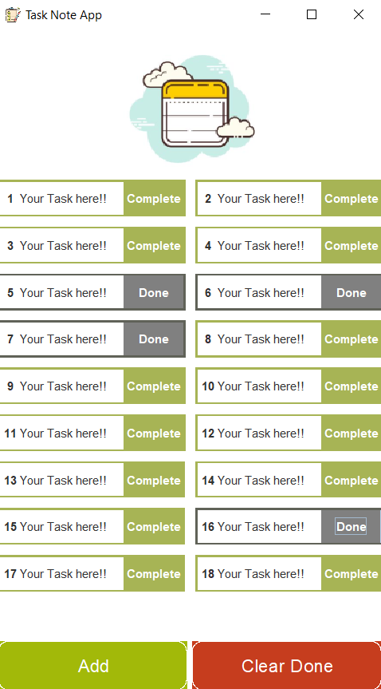

# Note Task mini-project
#### Hi, I'm An. 
This is a mini project after 1 week of learning about java and swing. 
I really would love to have a chance to dig deeper into java. 
Previously, I studied front-end and really wanted to know more about back-end. 
So the scholarship from **Shinhan DS** is really a great opportunity for me, that's why I made this project.

### This is the main interface
It is used to take notes on important tasks. I only do it at the interface level because I don't have much time to prepare for the mini-project. In the future I will connect to the database to complete the project

### Video demo
{@youtube: https://youtu.be/EPX1jL-xEYc}